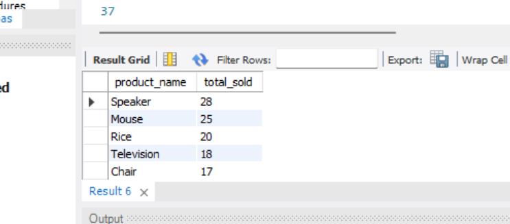
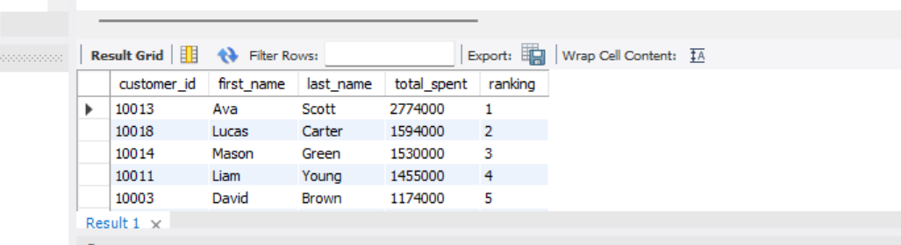
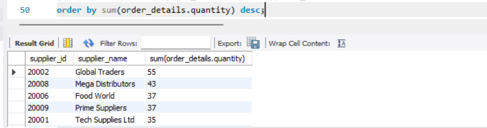
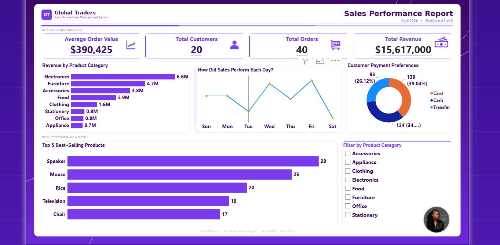
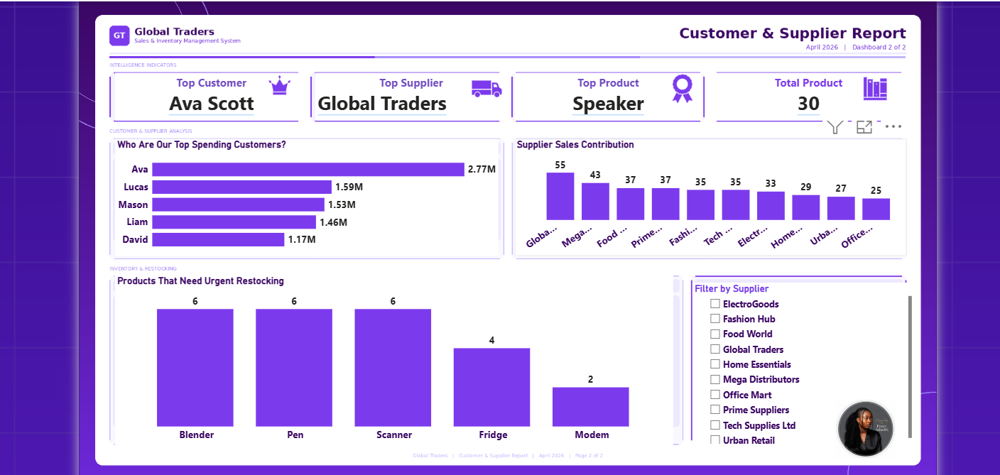

# SALES & INVENTORY MANAGEMENT SYSTEM
# SQL Database Design · Business Intelligence · Power BI Dashboard
---

# Table of Contents
---
- [Project Overview](#project-overview)
- [Business Problem](#business-problem)
- [Objectives](#objectives)
- [Database Design](#database-design)
- [Dataset Overview](#dataset-overview)
- [Tools Used](#tools-used)
- [Database Creation & Data Insertion](#database-creation--data-insertion)
- [Skills Demonstrated](#skills-demonstrated)
- [KPI Overview](#kpi-overview)
- [Business Insights](#business-insights)
- [Recommendations](#recommendations)
- [Dashboard](#dashboard)
- [Conclusion](#conclusion)

---

## Project Overview
---
Most businesses collect data every day but without
a proper system to store and query that data, the
information is useless.

This project involves designing and building a
complete Sales and Inventory Management System
from scratch using SQL for Global Traders a
retail business that sells products to customers
through multiple suppliers.

The system was built to track customer orders,
product performance, supplier activity, payments
and inventory then queried to answer real
business questions that management needs answered
every week.

| Stat | Value |
|------|-------|
| Database Name | sales_inventory_system |
| Total Tables | 6 |
| Total Records | 170+ |
| SQL Queries Written | 20+ |
| Dashboards Built | 2 |

---

## Business Problem
---
Global Traders had no centralised system to answer
basic but critical business questions:

- Which products are selling the most?
- Who are our most valuable customers?
- Which products need restocking urgently?
- Which suppliers are performing best?
- How much revenue is the business generating
  daily and monthly?

Without answers to these questions, decisions were
being made on guesswork not data. This project
fixes that.

---

## Objectives
---
- Design a normalised relational database that
  accurately models the business
- Populate the database with realistic retail data
- Write SQL queries that answer real management
  questions across sales, customers, products
  and suppliers
- Build a Power BI dashboard to visualise the
  findings for non-technical stakeholders

---

## Database Design
---
The database consists of 6 linked tables — each
one representing a real part of the business.
Every table connects to others through foreign
keys to ensure data consistency and accuracy.

**Table Structure:**

| Table | Purpose | Key Fields |
|-------|---------|------------|
| customers | Stores all customer records | customer_id, first_name, last_name, email, phone, city |
| suppliers | Stores supplier information | supplier_id, supplier_name, contact_email |
| products | Product catalogue with pricing | product_id, product_name, category, price, supplier_id |
| orders | Records every customer order | order_id, customer_id, order_date |
| order_details | Line items within each order | order_detail_id, order_id, product_id, quantity |
| payments | Payment records per order | payment_id, order_id, payment_date, amount, payment_method |

**Foreign Key Relationships:**
- `orders` → `customers` (customer_id)
- `order_details` → `orders` (order_id)
- `order_details` → `products` (product_id)
- `products` → `suppliers` (supplier_id)
- `payments` → `orders` (order_id)

---

## Tools Used
---
- **MySQL:** Used to write all SQL queries,
  database creation, table design, data insertion
  and business intelligence queries
- **Power BI:** Used to build 2 interactive
  dashboards visualising revenue, product
  performance, customer intelligence and
  supplier contribution
- **Power Query (in Power BI):** Used for data
  transformation before visualisation

---

## Database Creation & Data Insertion

**Step 1 — Created the database**

Created the sales_inventory_system database and
all 6 tables with correct data types, primary
keys, foreign keys and NOT NULL constraints.

**Step 2 — Inserted realistic data**

Populated all 6 tables with realistic Nigerian
retail data — 20 customers, 10 suppliers, 30
products across 5 categories, 40 orders and
40 payments.

**Step 3 — Verified all data with SELECT queries**

Ran SELECT * queries on all 6 tables to verify
data was inserted correctly before writing
business queries.

## Database Development

- Created a normalized relational database with six linked tables.
- Implemented primary and foreign key constraints.
- Populated the database with realistic retail data.
- Validated data integrity before analysis.

(image)

---

## Skills Demonstrated
---
- Relational Database Design from Scratch
- Primary Key and Foreign Key Implementation
- Referential Integrity Constraints
- Data Insertion and Validation
- Multi-table JOIN Queries (up to 5 tables)
- Window Functions — RANK() OVER
- Aggregation — SUM, COUNT, AVG, GROUP BY
- Filtering — WHERE, HAVING, IS NULL
- Subqueries and Correlated Subqueries
- Date Functions — DATE_FORMAT, DAYNAME
- Business Intelligence Query Writing
- Power BI Dashboard Development
- Data Storytelling for Non-Technical Audiences

---

## Business Insights

### Insight 1 — Revenue & Sales Performance

The business generated ₦15.6M in total revenue
across 40 orders from 20 customers — an average
order value of ₦390,000 per transaction. This
is a strong baseline that shows healthy per-order
spending.

**Key Takeaway:**
At ₦390K average order value, each customer
relationship is worth protecting. Losing even
one high-value customer has a significant impact
on total revenue.

---

### Insight 2 — Product Performance

Speaker is the best-selling product with 28 units
sold followed by Mouse at 25 units. Electronics
as a category generates ₦6.6M — more than any
other category combined. Rice is the top Food
item showing strong cross-category demand.

**Top 5 Best-Selling Products:**

**Key Takeaway:**
Speaker, Mouse and Rice must be restocked
immediately — they are selling fastest and
any stockout directly costs the business revenue.

---

### Insight 3 — Customer Intelligence

The top 3 customers — Ava Scott, Lucas Carter
and Mason Green — account for a disproportionate
share of total revenue. Ava Scott alone spent
₦2,774,000. These are not just customers —
they are the business's most critical
relationships.

**Key Takeaway:**
The top 3 customers represent a concentration
risk. If any one of them stops buying, revenue
drops significantly. A loyalty programme would
protect this revenue.

---

### Insight 4 — Supplier Performance

Global Traders leads all suppliers with 55 units
sold — followed closely by Mega Distributors and
Food World. The business is currently dependent
on a small number of top suppliers which creates
supply chain risk if any one underperforms.

**Key Takeaway:**
Negotiate volume discounts with the top 3
suppliers. Reduce dependency on any single
supplier to protect supply chain continuity.

---

### Insight 5 — Sales Peak Mid-Week and Drop Toward the Weekend

Daily sales analysis shows that transactions
peak mid-week and decline toward the weekend.
This pattern has direct implications for staffing,
inventory replenishment scheduling and promotional
timing.

**Key Takeaway:**
Schedule stock replenishments and maximum staff
coverage at the start of the week to capitalise
on mid-week peak demand.

---

## Recommendations

**Restock Immediately**
Speaker, Mouse and Rice are the fastest-selling
products. A stockout of any of these directly
costs the business sales — restock before levels
hit zero.

**Reward Loyal Customers**
Ava Scott, Lucas Carter and Mason Green are the
top 3 spenders. Offer them loyalty discounts or
early access to new products to retain their
business and grow their spend further.

**Invest in Electronics**
Electronics generates ₦6.6M — more than any
other category. Expanding the Electronics product
range and keeping stock levels high is the single
highest-return investment the business can make.

**Negotiate with Top Suppliers**
Global Traders leads in sales volume. Use this
leverage to negotiate bulk pricing and reduce
cost per unit — improving profit margins without
needing to increase prices.

**Reduce Supplier Dependency**
Diversify the supplier base to reduce risk.
If the top supplier experiences a delay, the
business needs alternatives ready to fulfil
orders without disruption.

---

## Dashboard
---
Two Power BI dashboards were built to visualise
the findings for non-technical stakeholders.

**Dashboard 1 — Sales Performance Report**
Covers total revenue, revenue by product category,
top 5 best-selling products, daily sales trend
and payment method breakdown.

**Dashboard 2 — Customer & Supplier Report**
Covers top spending customers, supplier sales
contribution and products that need urgent
restocking.

---

## Conclusion
---
This project demonstrates that a well-designed
database is not just a technical achievement,
it is a business tool.

In under 20 SQL queries, Global Traders now
knows exactly which products are driving revenue,
which customers are most valuable, which suppliers
are performing best and which products need
restocking before stock runs out.

The Power BI dashboards make all of this
accessible to anyone in the business no SQL
knowledge required.

This is what data analysis is supposed to do:
turn raw records into decisions that move the
business forward.

---

Thank you for reading!

Let's connect:

[LinkedIn](https://www.linkedin.com/in/peace-ada-95b341341)
[Portfolio](https://peace-ada.github.io/Data-Portfolio/)
[Email](mailto:peaceada100@gmail.com)
